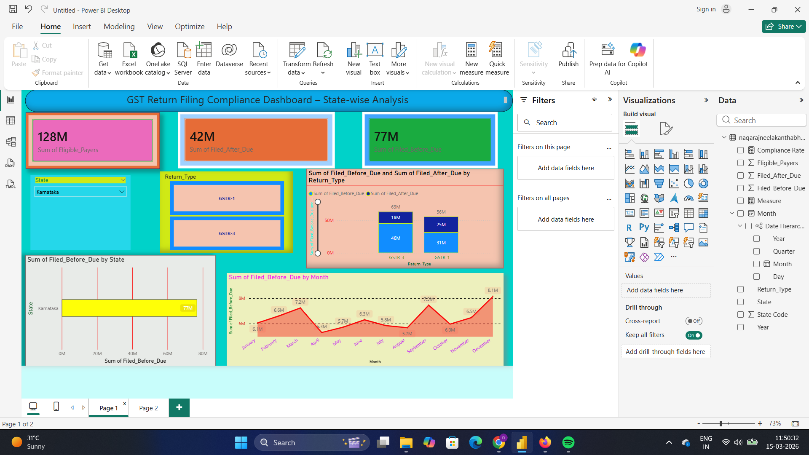
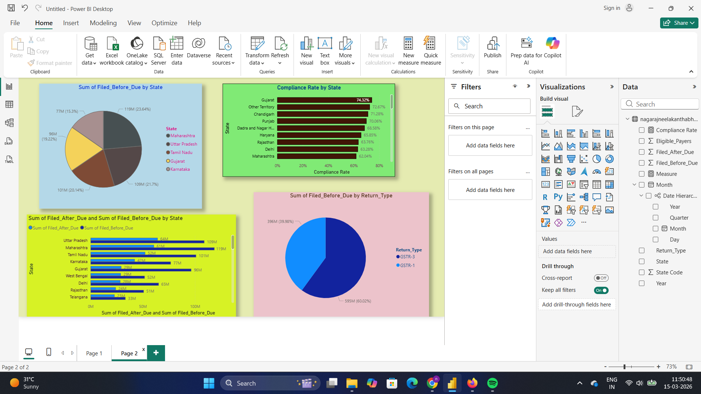

# GST Filing Compliance Dashboard

## 📊 Project Overview
This project presents an interactive **Power BI dashboard** analyzing GST return filing patterns across Indian states. The dashboard helps identify filing trends, compliance rates, and differences between return types.

The goal is to provide insights that can help understand **GST compliance behavior and filing patterns**.

## Project Story

In India, businesses registered under GST must file tax returns regularly. 
However, analyzing GST filing compliance across states using raw data is difficult.

This project presents an interactive Power BI dashboard that transforms 
complex GST datasets into clear visual insights. The dashboard helps analyze 
state-wise filing behavior, compliance rates, and filing trends using 
interactive visualizations.

By converting raw data into meaningful insights, the dashboard makes it 
easier to understand GST filing patterns and identify areas with higher 
or lower compliance.
---

## 📁 Dataset
The dataset contains GST return filing data including:

- State
- Return Type (GSTR-1, GSTR-3)
- Eligible Payers
- Filed Before Due Date
- Filed After Due Date
- Month and Year

---

## 📈 Dashboard Features

### Page 1 – Overview Dashboard
- KPI Cards showing total eligible payers and filing counts
- State filter and return type slicer
- Monthly filing trend analysis
- State-wise filing comparison
- Return type comparison

### Page 2 – Insights Dashboard
- Compliance rate by state
- State-wise filing comparison
- Return type distribution
- Top performing states

---

## 🛠 Tools Used
- **Power BI**
- **DAX**
- **Data Visualization**
- **GitHub**

---

## 📷 Dashboard Preview

### Overview Dashboard

### Insights Dashboard

---

## 📊 Key Insights
- Certain states show higher GST filing compliance.
- Filing trends vary across months.
- GSTR-1 and GSTR-3 return types show different filing patterns.
- Compliance rates help identify high-performing states.

---

## 🚀 How to Use
1. Download the `.pbix` file
2. Open in **Power BI Desktop**
3. Explore the interactive dashboard

---

## 👨‍💻 Author
Nagaraj Bhat
